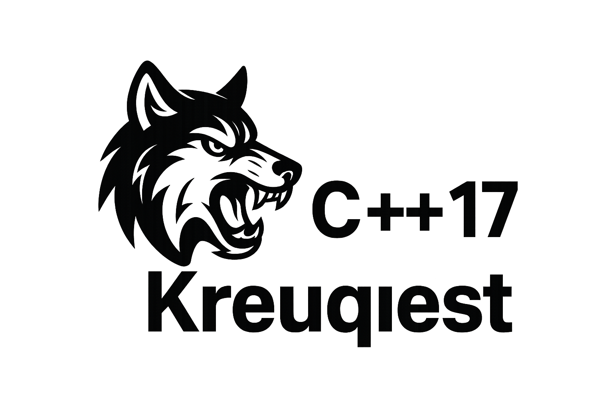

</h1> Beta 0.1 Version</h1>

<div id="language-nav">
    <a href="#en">English</a> | 
    <a href="#zh">中文</a> | 
    <a href="#ru">Русский</a>
</div>

<!-- English Version -->
<div id="en">
    <h2>Ve1rsion Introduction</h2>
    <ul>
        <li>This is a beta version implementing core functionality with minimal Boost.Asio usage</li>
        <li>Beta API features are limited. VisualUI updates tomorrow, Krequest maintenance every other day</li>
        <li>Please understand the update pace - balancing sleep, psychology, and development 😁</li>
    </ul>

<h3>Framework Introduction </h3>
<h5>Update - January 17, 2026 [UTC-8]</h5>
<div> <ul> <li>I completely rewrote all the code, including the request and template layers. Sometimes I wonder if my brain just isn’t smart enough—it was really tough. I guess I still have a lot to improve on.</li> <li>I changed the SSL calling method from a pure Boolean type call to request-type based calls, such as `SSLClientGet`, `SSLClientPost`, `HttpClientGet`, etc. This makes the structure more flexible and prevents the architecture from collapsing when adding new features.</li> <li>Also, I recommend not creating method objects using raw pointers—that’s risky. Please use `shared_ptr` to create them, or `unique_ptr` if you don’t want the object to be copied.</li> <div> And thank you all for following along. I’ll keep updating. If I’m slow, don’t worry—I’m probably just scratching my head in front of the computer, struggling with CMake errors… that’s a secret 🌚 </div> </ul> </div>

<h4>Framework Name: Krequest</h4>
<span>Author: KwzDev</span><br>
<span>Version: Beta 0.1</span>
<div>
    This framework will be integrated into Visual Beautiful UI in the future, though you can use it anywhere.
    I chose the Apache License for its flexibility - use it for web scraping, APIs, etc. No built-in JSON
    parser included; use your preferred library like json-cpp (my personal choice). If you'd like specific
    integrations, suggest them in Issues - I'll implement the most requested ones. While I'm not a Java fan,
    OKHttp's clean error handling is worth learning from 🌚 Expected in version 0.3.
</div>

<h2>Beta Quick Start</h2>


```cpp
#include "../src/Krequest.h"
#include <memory>

using namespace std;
using namespace KING::Krequest::RequestMethod;
using namespace KING::Krequest;

int main () {

    string makejson = "{\"name\" : \"jack\"}"; //test json

    //SSL request Get
    auto SSLGET = make_shared<Krequest::SSLClientGet>(); //make method object
    SSLGET->SetClientDomain("xxx.com") //settings domain
        .SetClientPath("/") //settings request api path 
        .SetUserAgent("Mozilla/5.0 (X11; Linux x86_64; rv:146.0) Gecko/20100101 Firefox/146.0")
        .StartRequest();
        const string status_code = SSLGET -> GetStatusCode();
        const string http_version = SSLGET -> GetHttpVersion();
        const string status_message = SSLGET -> GetStatusMessage();
        cout << "STATUS CODE : " << status_code << "\n"
             << "HTTP VERSION : " << http_version << "\n"
             << "STATUS MESSAGE : " << status_message 
             << std::endl;
    
    //SSL request Post
    auto SSLPOST = make_shared<Krequest::SSLClientPost>(); //make method object
    SSLGET->SetClientDomain("xxx.com") //settings domain
        .SetClientPath("/api/v1/xxx") //settings request api path 
        .SetClientContentType("application/json") //setting fetch type
        .AddClientHeader("author", "kezDev") //add request headers
        .SetUserAgent("Mozilla/5.0 (X11; Linux x86_64; rv:146.0) Gecko/20100101 Firefox/146.0")
        .SetRequestBody(makejson)
        .StartRequest();
        const string status_code_post = SSLGET -> GetStatusCode();
        const string http_version_post = SSLGET -> GetHttpVersion();
        const string status_message_post = SSLGET -> GetStatusMessage();
        cout << "STATUS CODE : " << status_code_post << "\n"
             << "HTTP VERSION : " << http_version_post << "\n"
             << "STATUS MESSAGE : " << status_message_post 
             << std::endl;
    
    //Base http Get
    auto HTTPGET = make_shared<Krequest::HttpClientGet>();
    HTTPGET->SetClientDomain("xxx.com")
        .SetClientPath("/")
        .SetUserAgent("Mozilla/5.0 (X11; Linux x86_64; rv:146.0) Gecko/20100101 Firefox/146.0")
        .StartRequest();
        const string status_code_http_get = HTTPGET -> GetStatusCode();
        const string http_version_http_get = HTTPGET -> GetHttpVersion();
        const string status_message_http_get = HTTPGET -> GetStatusMessage();
        cout << "STATUS CODE : " << status_code_http_get << "\n"
             << "HTTP VERSION : " << http_version_http_get << "\n"
             << "STATUS MESSAGE : " << status_message_http_get 
             << std::endl;

    //Base http Get 
    auto HTTPPOST = make_shared<Krequest::HttpClientPost>();
    HTTPPOST->SetClientDomain("xxx.com")
        .SetClientPath("/api/xxx")
        .SetUserAgent("Mozilla/5.0 (X11; Linux x86_64; rv:146.0) Gecko/20100101 Firefox/146.0")
        .AddClientHeader("author", "kwzDev")
        .SetClientContentType("application/json")
        .SetRequestBody(makejson)
        .StartRequest();
        const string status_code_http_post = HTTPPOST -> GetStatusCode();
        const string http_version_http_post = HTTPPOST -> GetHttpVersion();
        const string status_message_http_post = HTTPPOST -> GetStatusMessage();
        cout << "STATUS CODE : " << status_code_http_post << "\n"
             << "HTTP VERSION : " << http_version_http_post << "\n"
             << "STATUS MESSAGE : " << status_message_http_post 
             << std::endl;
}
```
<h2>My Development Journey 😅</h2>
<p>This experience has been... intense. IDE showed no errors during coding, but compilation unleashed
hundreds of error lines. I initially blamed CMake dependencies, but the real culprit was template
metaprogramming issues with Boost.Asio. After 30+ compilation attempts and debugging parameter mismatches
(seriously, what does this library even want?), I finally got it compiling. Then came segfaults and null
pointer issues. After fixing those, here's this barely functional beta. I need a break now. Please report
any issues directly!</p>

<h2>Proof This Isn't AI-Generated (Error Screenshots)</h2>


<p>Time for a well-deserved rest. Good night, everyone!</p>
</div>

<!-- Russian Version -->
<div id="ru">
    <h2>О версии</h2>
    <ul>
        <li>Бета-версия с базовой функциональностью на минимальном использовании Boost.Asio</li>
        <li>Ограниченный API в бета-версии. Завтра обновление VisualUI, поддержка Krequest через день</li>
        <li>Пожалуйста, поймите темп обновлений - балансирую между сном, психологией и разработкой 😁</li>
    </ul>

**Обновление — 17 января 2026 г. [UTC-8]**
<div>
    <ul>
        <li>Я полностью переписал весь код, включая слои запросов и шаблонов. Иногда кажется, что мой мозг просто недостаточно сообразителен — это было действительно сложно. Видимо, мне ещё есть куда расти.</li>
        <li>Изменил метод вызова SSL с чисто булевого типа на вызовы по типу запросов, такие как `SSLClientGet`, `SSLClientPost`, `HttpClientGet` и т.д. Это делает структуру более гибкой и предотвращает "обрушение" архитектуры при добавлении новых функций.</li>
        <li>Также рекомендую не создавать объекты методов с использованием "сырых" указателей — это рискованно. Пожалуйста, используйте `shared_ptr`, а если не хотите, чтобы объект копировался — `unique_ptr`.</li>
        <div>
            И спасибо всем, кто следит за обновлениями. Я продолжу работу. Если что-то выходит медленно, не переживайте — скорее всего, я просто сижу перед компьютером и ломаю голову над ошибками CMake… но это секрет 🌚
        </div>
    </ul>
</div>

<h2>О фреймворке</h2>
    
    <h4>Название: Krequest</h4>
    <span>Автор: KwzDev</span><br>
    <span>Версия: Beta 0.1</span>
    <div>
        Этот фреймворк будет интегрирован в Visual Beautiful UI в будущем, но вы можете использовать его где угодно.
        Я выбрал лицензию Apache для её гибкости - используйте для парсинга, API и т.д. Встроенного JSON-парсера нет;
        используйте свою библиотеку, например json-cpp (мой выбор). Если хотите определённые интеграции, предлагайте
        в Issues - реализую самые популярные. Хотя я не фанат Java, чистая обработка ошибок в OKHttp достойна изучения 🌚
        Ожидается в версии 0.3.
    </div>
<h2>Быстрый старт (Beta)</h2>

```cpp
#include "../src/Krequest.h"
#include <memory>

using namespace std;
using namespace KING::Krequest::RequestMethod;
using namespace KING::Krequest;

int main () {

    string makejson = "{\"name\" : \"jack\"}"; //test json

    //SSL request Get
    auto SSLGET = make_shared<Krequest::SSLClientGet>(); //make method object
    SSLGET->SetClientDomain("xxx.com") //settings domain
        .SetClientPath("/") //settings request api path 
        .SetUserAgent("Mozilla/5.0 (X11; Linux x86_64; rv:146.0) Gecko/20100101 Firefox/146.0")
        .StartRequest();
        const string status_code = SSLGET -> GetStatusCode();
        const string http_version = SSLGET -> GetHttpVersion();
        const string status_message = SSLGET -> GetStatusMessage();
        cout << "STATUS CODE : " << status_code << "\n"
             << "HTTP VERSION : " << http_version << "\n"
             << "STATUS MESSAGE : " << status_message 
             << std::endl;
    
    //SSL request Post
    auto SSLPOST = make_shared<Krequest::SSLClientPost>(); //make method object
    SSLGET->SetClientDomain("xxx.com") //settings domain
        .SetClientPath("/api/v1/xxx") //settings request api path 
        .SetClientContentType("application/json") //setting fetch type
        .AddClientHeader("author", "kezDev") //add request headers
        .SetUserAgent("Mozilla/5.0 (X11; Linux x86_64; rv:146.0) Gecko/20100101 Firefox/146.0")
        .SetRequestBody(makejson)
        .StartRequest();
        const string status_code_post = SSLGET -> GetStatusCode();
        const string http_version_post = SSLGET -> GetHttpVersion();
        const string status_message_post = SSLGET -> GetStatusMessage();
        cout << "STATUS CODE : " << status_code_post << "\n"
             << "HTTP VERSION : " << http_version_post << "\n"
             << "STATUS MESSAGE : " << status_message_post 
             << std::endl;
    
    //Base http Get
    auto HTTPGET = make_shared<Krequest::HttpClientGet>();
    HTTPGET->SetClientDomain("xxx.com")
        .SetClientPath("/")
        .SetUserAgent("Mozilla/5.0 (X11; Linux x86_64; rv:146.0) Gecko/20100101 Firefox/146.0")
        .StartRequest();
        const string status_code_http_get = HTTPGET -> GetStatusCode();
        const string http_version_http_get = HTTPGET -> GetHttpVersion();
        const string status_message_http_get = HTTPGET -> GetStatusMessage();
        cout << "STATUS CODE : " << status_code_http_get << "\n"
             << "HTTP VERSION : " << http_version_http_get << "\n"
             << "STATUS MESSAGE : " << status_message_http_get 
             << std::endl;

    //Base http Get 
    auto HTTPPOST = make_shared<Krequest::HttpClientPost>();
    HTTPPOST->SetClientDomain("xxx.com")
        .SetClientPath("/api/xxx")
        .SetUserAgent("Mozilla/5.0 (X11; Linux x86_64; rv:146.0) Gecko/20100101 Firefox/146.0")
        .AddClientHeader("author", "kwzDev")
        .SetClientContentType("application/json")
        .SetRequestBody(makejson)
        .StartRequest();
        const string status_code_http_post = HTTPPOST -> GetStatusCode();
        const string http_version_http_post = HTTPPOST -> GetHttpVersion();
        const string status_message_http_post = HTTPPOST -> GetStatusMessage();
        cout << "STATUS CODE : " << status_code_http_post << "\n"
             << "HTTP VERSION : " << http_version_http_post << "\n"
             << "STATUS MESSAGE : " << status_message_http_post 
             << std::endl;
}
```

<h2>Мой путь разработки 😅</h2>
<p>Этот опыт был... интенсивным. IDE не показывала ошибок при написании кода, но компиляция обрушила
сотни строк ошибок. Сначала я винил зависимости CMake, но настоящей проблемой оказалась метапрограммирование
шаблонов в Boost.Asio. После 30+ попыток компиляции и отладки несоответствий параметров (серьёзно, чего эта
библиотека вообще хочет?), я наконец добился компиляции. Затем последовали segmentation fault и проблемы с
нулевыми указателями. После их исправления получилась эта едва функциональная бета. Мне нужен перерыв.
Сообщайте о проблемах напрямую!</p>

<h2>Доказательство, что это не код от ИИ (скриншоты ошибок)</h2>


<p>Время заслуженного отдыха. Спокойной ночи, всем!</p>
</div>

<h1> Krequest Beta 0.1 Version </h1>

<div>
    <h2>版本介绍</h2>
    <ul>
        <li>这是 测试版本 只是通过 少量的 Boost.Asio 实现我的主要功能</li>
        <li>Beta API 功能 十分稀少 我明天要更新 VisualUI 不会更新Krequest 但是我是两天维护不同框架</li>
        <li>希望大家可以原谅我的更新速度 平时我也有点压力 不管是睡眠上或者是 心理上请大家可以谅解下 😁</li>
    </ul>
</div>

<div>
<h3>更新 - 2026 年 1 月 17日 [UTC-8]</h3>
        <div>
            <ul>
                <li>我重写了全部包括请求层与模板层真有点怀疑自己的脑子是不是不太聪明,真的太难了,我觉得自己还得继续提升</li>
                <li>我将SSL的调用方法从纯Bool类型调用改变层了请求类型比如 SSLClientGet , SSLClientPost , HttpClientGet ...等这样灵活性比较强大不因为加入新的功能架构崩塌</li>
                <li>以及我推荐大家不用纯裸体指针创建方法对象这很危险请用shared_ptr创建如果不想被复制请用 unique_ptr创建对象</li>
                <div>
                    以及在这感谢大家的关注,我会持续更新我如果更新慢不要怀疑我多半在电脑面前挠头毕竟CMake报错......这是秘密🌚
                </div>
            </ul>
        </div>
    <h2>框架介绍</h2>
    
    <h4>框架名: Krequest</h4>
    <span>作者: KwzDev</span><br>
    <span>版本: Beta 0.1</span>
    <div>
        此框架未来将会用于Visual Beautiful UI当中,额当然你也可以用到其他地方我这次选择的
        Apache 许可证十分宽松 你可以用到任何地方 包括爬虫 我没有写 专门用户 Json 处理的工具
        当然你可以自由选择 Json 处理工具 比如说 json-cpp 这就是我经常 用的如果 大家觉得我可以集成
        可以在提议中告诉我我会挑选最多的工具集成在这个框架中 我虽然不是特别喜欢Java但是他的OKhttp库我感觉可以参考学习下 清晰的 错误回调处理 我感觉可以学习下🌚等待我预计 0.3 会有
    </div>
</div>

<h2>Beat版本快速开始</h2>

```cpp     
#include "../src/Krequest.h"
#include <memory>

using namespace std;
using namespace KING::Krequest::RequestMethod;
using namespace KING::Krequest;

int main () {

    string makejson = "{\"name\" : \"jack\"}"; //test json

    //SSL request Get
    auto SSLGET = make_shared<Krequest::SSLClientGet>(); //make method object
    SSLGET->SetClientDomain("xxx.com") //settings domain
        .SetClientPath("/") //settings request api path 
        .SetUserAgent("Mozilla/5.0 (X11; Linux x86_64; rv:146.0) Gecko/20100101 Firefox/146.0")
        .StartRequest();
        const string status_code = SSLGET -> GetStatusCode();
        const string http_version = SSLGET -> GetHttpVersion();
        const string status_message = SSLGET -> GetStatusMessage();
        cout << "STATUS CODE : " << status_code << "\n"
             << "HTTP VERSION : " << http_version << "\n"
             << "STATUS MESSAGE : " << status_message 
             << std::endl;
    
    //SSL request Post
    auto SSLPOST = make_shared<Krequest::SSLClientPost>(); //make method object
    SSLGET->SetClientDomain("xxx.com") //settings domain
        .SetClientPath("/api/v1/xxx") //settings request api path 
        .SetClientContentType("application/json") //setting fetch type
        .AddClientHeader("author", "kezDev") //add request headers
        .SetUserAgent("Mozilla/5.0 (X11; Linux x86_64; rv:146.0) Gecko/20100101 Firefox/146.0")
        .SetRequestBody(makejson)
        .StartRequest();
        const string status_code_post = SSLGET -> GetStatusCode();
        const string http_version_post = SSLGET -> GetHttpVersion();
        const string status_message_post = SSLGET -> GetStatusMessage();
        cout << "STATUS CODE : " << status_code_post << "\n"
             << "HTTP VERSION : " << http_version_post << "\n"
             << "STATUS MESSAGE : " << status_message_post 
             << std::endl;
    
    //Base http Get
    auto HTTPGET = make_shared<Krequest::HttpClientGet>();
    HTTPGET->SetClientDomain("xxx.com")
        .SetClientPath("/")
        .SetUserAgent("Mozilla/5.0 (X11; Linux x86_64; rv:146.0) Gecko/20100101 Firefox/146.0")
        .StartRequest();
        const string status_code_http_get = HTTPGET -> GetStatusCode();
        const string http_version_http_get = HTTPGET -> GetHttpVersion();
        const string status_message_http_get = HTTPGET -> GetStatusMessage();
        cout << "STATUS CODE : " << status_code_http_get << "\n"
             << "HTTP VERSION : " << http_version_http_get << "\n"
             << "STATUS MESSAGE : " << status_message_http_get 
             << std::endl;

    //Base http Get 
    auto HTTPPOST = make_shared<Krequest::HttpClientPost>();
    HTTPPOST->SetClientDomain("xxx.com")
        .SetClientPath("/api/xxx")
        .SetUserAgent("Mozilla/5.0 (X11; Linux x86_64; rv:146.0) Gecko/20100101 Firefox/146.0")
        .AddClientHeader("author", "kwzDev")
        .SetClientContentType("application/json")
        .SetRequestBody(makejson)
        .StartRequest();
        const string status_code_http_post = HTTPPOST -> GetStatusCode();
        const string http_version_http_post = HTTPPOST -> GetHttpVersion();
        const string status_message_http_post = HTTPPOST -> GetStatusMessage();
        cout << "STATUS CODE : " << status_code_http_post << "\n"
             << "HTTP VERSION : " << http_version_http_post << "\n"
             << "STATUS MESSAGE : " << status_message_http_post 
             << std::endl;
}
```
<h2>我的绝望心理😅</h2>
<p>这个我真的要说太牛逼了,我写的时候Ide不报错当我开心准备编译时候......<br>
突然几百行报错我靠了我都不知道那错了一直以为是CMake依赖问题但是我不管怎么改变的都没有用
然后我问AI才知道是模板元编程问题然后我再那各种改Boost.Asio的参数我也不知道参数到底是什么他想要什么
我也是懵的然后30次make尝试后我终于可以编译了但是我运行又是段错误,空指针在我改正后勉强做出这个可用版本我现在需要休息了
如果有什么问题直接提议就好啦</p>
<h2>还有我担心你们说我是AI写的代码我的报错图片是最好的证明</h2>


<span>我现在需要好好休息了,晚安我的朋友们</span>